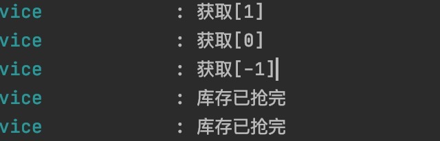

## 秒杀场景模拟
    秒杀场景的特点就是高并发，而高并发带来的问题就是会对服务器造成很大的压力，所以如何
    缓解这些压力和提高QPS就是秒杀优化所要解决的重要问题。主要的措施就是通过redis实现缓存来减少
    数据库的压力，通过消息队列完成异步下单，来提升用户的体验以及削峰限流。
    
### 注意事项
    1、
    
    
### DB构建语句
```sql
create table if not exists goods
(
	id varchar(32) not null
		primary key,
	gs_name varchar(16) null comment '商品名称',
	gs_count int null comment '总库存',
	surplus int null comment '剩余',
	create_time datetime null comment '创建时间'
)
comment '库存表';
```    

### 压测过程的问题与解决方案
    1、超卖问题

    2、解决方案[待定]
    
    
[压测文件](./src/main/resources/static/压测jmeter请求.jmx)